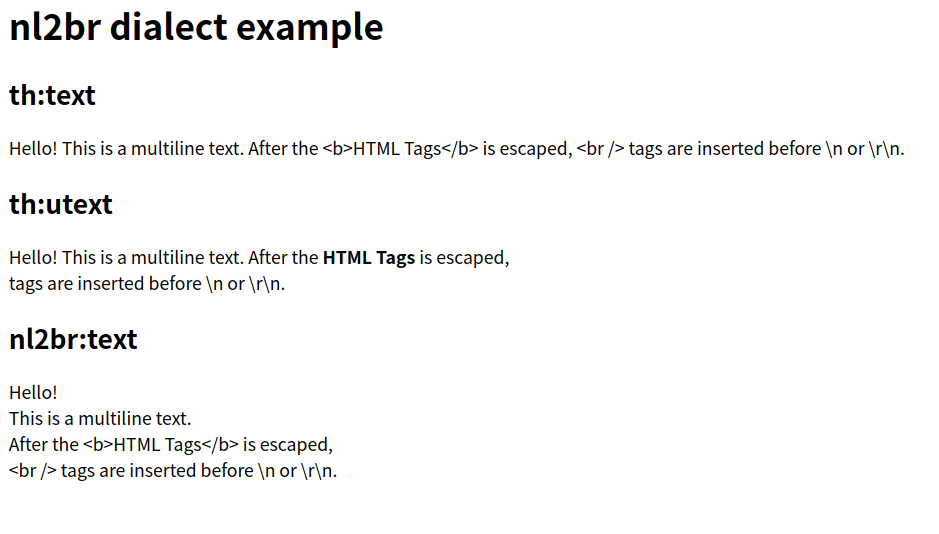

# thymeleaf-extras-nl2br

`Nl2brDialect` enables you to use `nl2br:text` attibute. With this attribute, HTML line breaks(`<br />`) are inserted before newlines. But the HTML tags are escaped before the process.

## Requirements

* Thymeleaf3.x
* HTML template mode

## Example

Template:

```
<h1>nl2br dialect example</h1>

<h2>th:text</h2>
<p th:text="${sample}">Hello!</p>

<h2>th:utext</h2>
<p th:utext="${sample}">Hello!</p>

<h2>nl2br:text</h2>
<p nl2br:text="${sample}">Hello!</p>
```

Data:

```
"Hello!\nThis is a multiline text.\r\nAfter the <b>HTML Tags</b> is escaped,\n <br /> tags are inserted before \\n or \\r\\n."
```

Result:



## Setup

### Maven

```
<dependency>
  <groupId>com.github.bufferings</groupId>
  <artifactId>thymeleaf-extras-nl2br</artifactId>
  <version>1.0.0</version>
</dependency>
```

### Code

If you use Thymeleaf directly, please add `Nl2brDialect` to the template engine.

```
templateEngine.addDialect(new Nl2brDialect());
```

If you use Spring Boot, you can set it like this:

```
@Bean
public Nl2brDialect dialect() {
  return new Nl2brDialect();
}
```

### Attribute

You can use `nl2br:text` like `th:text`. All the HTML tags are escaped before adding `<br />`:

```
<p nl2br:text="${sample}">Hello!</p>
```

It's good to add `xmlns:nl2br` to stop IDE warning:

```
<!DOCTYPE html>
<html lang="en" xmlns="http://www.w3.org/1999/html"
      xmlns:th="http://www.thymeleaf.org"
      xmlns:nl2br="https://github.com/bufferings/thymeleaf-extras-nl2br">
<head>
```
